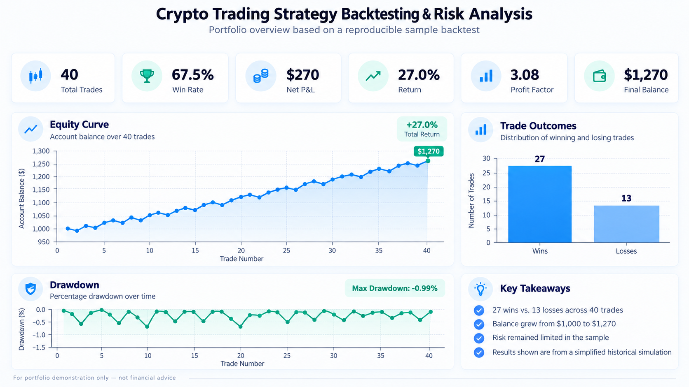

# Crypto Trading Strategy Backtesting & Risk Analysis

A Python Data Analytics portfolio project for evaluating a rule-based trading strategy on historical price data and measuring both performance and risk.

## Portfolio overview



*Visual summary of the sample backtest, including performance KPIs, equity curve, trade outcomes, and drawdown analysis.*

## Project overview

I originally built this project as a broader trading-simulation system. For the portfolio version, I redesigned it around the analytical core: historical price data, reproducible backtesting, trade-level outputs, KPI calculation, and risk analysis.

The public version is intentionally independent of live exchange APIs, credentials, local server paths, and private infrastructure.

## Analytical question

**How does a threshold-based long/short strategy perform when position size increases after losses?**

The backtest tracks each trade, account balance, win/loss outcome, wager size, and direction. The results are then summarized using performance and risk KPIs.

## What this project demonstrates

- Data preparation and analysis with **Python** and **Pandas**
- Rule-based backtesting on historical price data
- Trade-level result generation
- Performance and risk KPI calculation
- Equity-curve visualization with **Matplotlib**
- Reproducible analytical workflow using local sample data
- Separation of portfolio analytics from live-trading infrastructure

## Sample results

Using the included sample dataset and configuration, the backtest produces:

- **40 total trades**
- **27 winning trades / 13 losing trades**
- **67.5% win rate**
- **$270 net P&L**
- **27.0% return** on the sample starting balance
- **3.08 profit factor**
- **$1,270 final balance** from a $1,000 starting balance
- **-$10 maximum drawdown**
- **-0.99% maximum drawdown**
- **$20 maximum wager**

These values demonstrate the analytical workflow on the included sample data. They should not be interpreted as evidence of real-world profitability.

## Strategy logic

1. Start with a fixed initial balance and wager.
2. Enter a LONG position.
3. Move through historical prices until price changes by the configured threshold.
4. Mark the trade as a win or loss based on direction.
5. Reset wager after a win.
6. Increase wager and switch direction after a loss.
7. Stop when data ends, balance reaches zero, or the configured maximum loss streak is reached.

## Analytical workflow

1. Load the historical price series from `data/sample_prices.csv`.
2. Apply the strategy rules using `src/backtest.py`.
3. Store each trade with direction, price movement, outcome, wager, P&L, and ending balance.
4. Calculate summary KPIs including win rate, return, profit factor, drawdown, and final balance.
5. Save detailed results to `results/sample_backtest_results.csv`.
6. Generate an equity-curve visualization from the trade-level results.

## Project structure

```text
.
├── README.md
├── run_analysis.py
├── visualize_results.py
├── requirements.txt
├── src/
│   ├── __init__.py
│   └── backtest.py
├── data/
│   ├── README.md
│   └── sample_prices.csv
├── results/
│   └── sample_backtest_results.csv
└── assets/
    ├── README.md
    └── backtesting-analysis-overview.png
```

## Run locally

Install the dependencies:

```bash
pip install -r requirements.txt
```

Run the backtest:

```bash
python run_analysis.py
```

Generate the equity curve:

```bash
python visualize_results.py
```

The analysis script prints the KPI summary and writes detailed trade-level results to `results/sample_backtest_results.csv`. The visualization script generates `assets/equity_curve.png` locally.

## KPI definitions

- **Win Rate** = winning trades / total trades
- **Net P&L** = total profits minus total losses
- **Return %** = percentage change from the initial balance to final balance
- **Profit Factor** = gross profit / gross loss
- **Maximum Drawdown** = largest decline in account balance from a previous peak
- **Maximum Wager** = highest position wager reached during the simulation

## Analytical limitations

- The project analyzes a simplified rule-based simulation, not live trading performance.
- Transaction costs, slippage, liquidity, and execution latency are not modeled.
- The sample dataset is intentionally compact and is used to demonstrate the analytical workflow.
- A strategy that performs well historically may perform differently under other market conditions.

## Portfolio note

This repository is designed as a Data Analytics project rather than a production trading system. The focus is on reproducibility, KPI design, trade-level analysis, and communicating performance and risk clearly.

## Disclaimer

This project is for data-analysis and software demonstration purposes only. It is not financial advice and does not represent a validated trading strategy.
